# ПРИЗМА — Руководство пользователя

**Версия:** 1.0
**Дата:** 29.03.2026

> **ПРИЗМА** — **П**ланирование **Р**есурсов **И** **З**адач, **М**ониторинг и **А**нализ

---

## Содержание

1. [Начало работы](#1-начало-работы)
2. [Навигация по системе](#2-навигация-по-системе)
3. [Стартовая страница (Дашборд)](#3-стартовая-страница-дашборд)
4. [Управление проектами (УП)](#4-управление-проектами-уп)
5. [Производственный план (ПП)](#5-производственный-план-пп)
6. [Сводное планирование (СП)](#6-сводное-планирование-сп)
7. [Журнал извещений (ЖИ)](#7-журнал-извещений-жи)
8. [Аналитика](#8-аналитика)
9. [Производственный календарь](#9-производственный-календарь)
10. [Сотрудники](#10-сотрудники)
11. [План отпусков и командировок](#11-план-отпусков-и-командировок)
12. [Профиль и настройки](#12-профиль-и-настройки)
13. [Горячие клавиши и быстрые действия](#13-горячие-клавиши-и-быстрые-действия)
14. [Роли и права доступа](#14-роли-и-права-доступа)
15. [Типовые сценарии работы](#15-типовые-сценарии-работы)
16. [Устранение неполадок и FAQ](#16-устранение-неполадок-и-faq)

---

## 1. Начало работы

### 1.1 Вход в систему

1. Откройте браузер и перейдите по адресу системы (например, `http://prizm.ntc.local`).
2. На экране авторизации введите:
   - **Логин** — ваше имя пользователя, выданное администратором
   - **Пароль** — пароль учётной записи
3. Нажмите кнопку **«Войти»**.

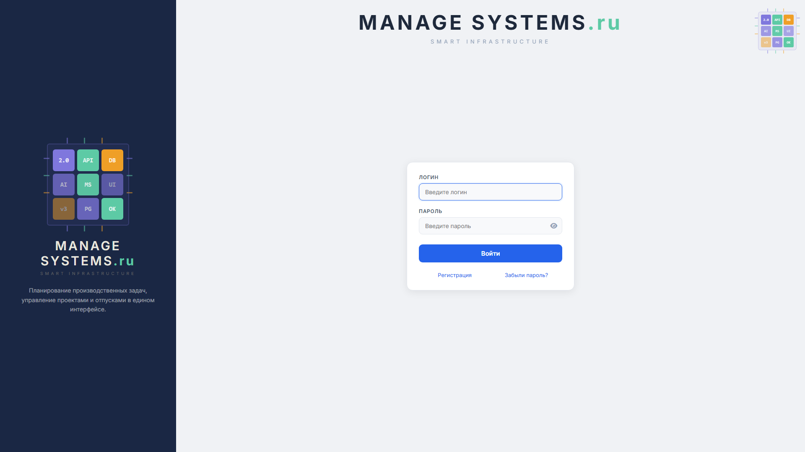
*Рис. 1.1. Экран авторизации ПРИЗМА*

> **Совет.** Если вы забыли пароль, нажмите ссылку **«Забыли пароль?»** под формой входа — на вашу корпоративную почту придёт письмо со ссылкой для сброса.

### 1.2 Первый вход и обучение

При первом входе автоматически запускается **интерактивный тур** — пошаговое обучение по всем модулям системы (17 шагов). Тур проведёт вас по основным разделам:

```
Шаг 1:  Боковая панель навигации
Шаг 2:  Стартовая страница
Шаг 3:  Управление проектами
Шаг 4:  Производственный план
Шаг 5:  Добавление строк ПП
Шаг 6:  Зависимости задач
Шаг 7:  Синхронизация ПП → СП
Шаг 8:  Переход в СП
Шаг 9:  Обзор сводного планирования
Шаг 10: Редактирование задачи
Шаг 11: Модальное окно задачи
Шаг 12: Отчёт по задаче
Шаг 13: Ошибки планирования
Шаг 14: Журнал извещений
Шаг 15: Производственный календарь
Шаг 16: Роли и права доступа
Шаг 17: Профиль и настройки
```

Управление туром:
- **Следующий шаг** — кнопка «Далее» или клавиша **Enter**
- **Пропустить тур** — клавиша **Esc**
- **Перезапустить тур** — Профиль → «Пройти обучение»

Во время тура система автоматически переводит вас на нужные страницы, подсвечивает элементы интерфейса и показывает информационные карточки с описанием.

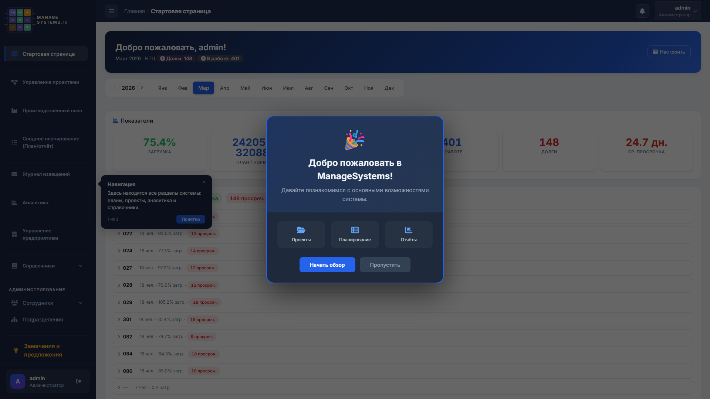
*Рис. 1.2. Пример шага обучающего тура — подсветка элемента и информационная карточка*

### 1.3 Общая структура экрана

После входа вы видите стандартную компоновку интерфейса:

```
┌──────────────────────────────────────────────────────────┐
│  ☰  Главная > Стартовая страница        🔔  admin  ▼   │  ← Шапка
├────────┬─────────────────────────────────────────────────┤
│        │                                                 │
│  Боко- │                                                 │
│  вая   │            Основная рабочая область             │
│  пане- │                                                 │
│  ль    │         (содержимое текущей страницы)            │
│        │                                                 │
│  нави- │                                                 │
│  гации │                                                 │
│        │                                                 │
└────────┴─────────────────────────────────────────────────┘
```

**Шапка** содержит:
- Кнопку **☰** (скрыть/показать боковую панель)
- **Хлебные крошки** — путь к текущей странице (кликабельные ссылки)
- Кнопку **🔔 Уведомления** — с счётчиком непрочитанных
- **Имя пользователя** и роль

---

## 2. Навигация по системе

### 2.1 Боковая панель (сайдбар)

Левая боковая панель — основной способ навигации. Она всегда видна и содержит все разделы системы.

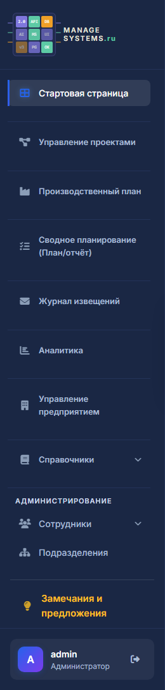
*Рис. 2.1. Боковая панель навигации*

**Основные разделы:**

| Иконка | Раздел | Назначение |
|--------|--------|------------|
| 🏠 | **Стартовая страница** | Дашборд — персональная сводка, метрики |
| 📁 | **Управление проектами** | Реестр проектов и изделий |
| 🏭 | **Производственный план** | Формирование и ведение ПП подразделения |
| 📋 | **Сводное планирование** | Единый план-отчёт с помесячными часами |
| 📰 | **Журнал извещений** | Учёт ИИ/ПИ с контролем сроков погашения |
| 📊 | **Аналитика** | Графики загрузки, исполнения, метрики |

**Справочники** (раскрывающийся раздел):

| Раздел | Назначение |
|--------|------------|
| 📅 Производственный календарь | Рабочие часы, праздничные дни по месяцам |
| 📏 Нормативы | Нормативная база (в разработке) |

**Администрирование** (раскрывающийся раздел):

| Раздел | Назначение | Доступ |
|--------|------------|--------|
| 👥 Список сотрудников | Справочник сотрудников с ролями | Все |
| 🏖 План отпусков | Учёт и планирование отпусков | Все |
| ✈ План командировок | Учёт командировок | Все |
| 📝 Журнал аудита | Протокол всех действий | Только админ |
| ⚙ Настройки системы | Административная панель Django | Только админ |

**Нижняя часть панели:**
- 💬 **Замечания и предложения** — обратная связь разработчику
- 👤 **Профиль** (аватар, имя, роль) — настройки и выход

Активный раздел подсвечивается цветной полоской слева.

> **Совет.** Нажмите кнопку **☰** в шапке, чтобы свернуть сайдбар и увеличить рабочую область. Повторное нажатие развернёт его обратно.

### 2.2 Командная палитра (Ctrl+K)

Быстрый способ перейти в любой раздел или выполнить действие — **командная палитра**.

**Как использовать:**

1. Нажмите **Ctrl+K** (или **Cmd+K** на Mac) — на любой странице.
2. Откроется окно поиска с полем ввода.
3. Начните набирать название раздела или ключевое слово.
4. Система покажет подходящие результаты с нечётким поиском.
5. Выберите нужный пункт стрелками **↑↓** и нажмите **Enter**.
6. Закрыть палитру — **Esc**.

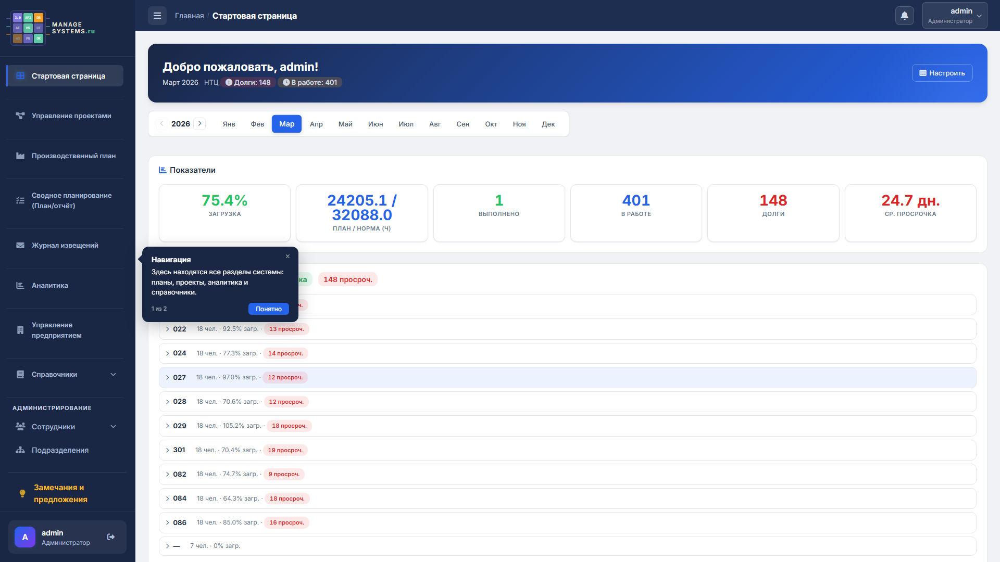
*Рис. 2.2. Командная палитра — быстрый поиск по системе*

**Доступные команды (13 навигационных + контекстные):**

| Команда | Ключевые слова |
|---------|----------------|
| Стартовая страница | дашборд, главная |
| Управление проектами | проект, изделие |
| Производственный план | пп, production |
| Сводное планирование | план, отчёт, plan, report |
| Журнал извещений | извещение, жи, notice |
| Аналитика | графики, метрики, analytics |
| Производственный календарь | календарь, праздники |
| Список сотрудников | сотрудник, employee |
| План отпусков | отпуск, vacation |
| План командировок | командировка, trip |
| Замечания и предложения | обратная связь, feedback |
| Журнал аудита | аудит, лог |
| Профиль | настройки, profile |

**Контекстные действия** (зависят от текущей страницы):
- На странице СП: **«Новая задача»** — открывает форму создания
- На таблицах: **«Экспорт»** — выгрузка данных
- Глобально: **«Сменить тему»** — переключение темы оформления

### 2.3 Хлебные крошки

В шапке под строкой навигации отображается путь к текущей странице:

```
Главная  >  Производственный план  >  ПП-21 "Орёл"
```

Каждый элемент — кликабельная ссылка для быстрого возврата на уровень выше.

### 2.4 Уведомления

Колокольчик **🔔** в правом верхнем углу шапки показывает системные уведомления:
- Приближающиеся дедлайны задач
- Изменения в задачах, назначенных вам
- Системные сообщения

Красный счётчик на колокольчике показывает количество непрочитанных уведомлений. Нажмите на колокольчик, чтобы раскрыть список, и кнопку **«Прочитать все»** для очистки.

---

## 3. Стартовая страница (Дашборд)

### 3.1 Общий вид

Стартовая страница — это персональная сводка, которая отличается в зависимости от вашей роли.

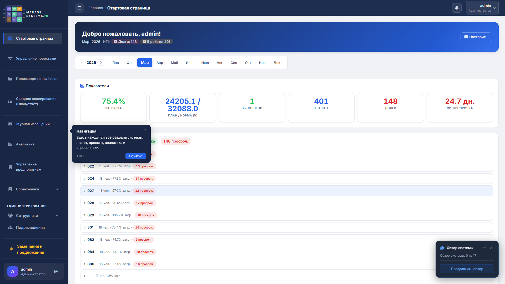
*Рис. 3.1. Стартовая страница (дашборд) — вид для руководителя*

### 3.2 Элементы дашборда

**Приветствие и дата:**
Вверху — имя пользователя, текущий месяц, центр/отдел, общая статистика (долги, в работе).

**Панель периода:**
- Переключатель года (стрелки ◀ ▶)
- Кнопки месяцев (Янв–Дек) — выбор периода для метрик

**Карточки показателей:**

| Карточка | Описание |
|----------|----------|
| **Загрузка** | Процент загрузки подразделения (план/норма) |
| **План / Норма (ч)** | Абсолютные значения: запланировано / доступно часов |
| **Выполнено** | Количество завершённых задач |
| **В работе** | Количество задач в работе |
| **Долги** | Количество просроченных задач |
| **Ср. просрочка** | Среднее количество дней просрочки |

**Блок «Команда»** (для руководителей):
Список отделов/секторов с показателями:
```
021  21 чел. · 54.4% загр. · 17 просроч.
022  18 чел. · 92.5% загр. · 13 просроч.
029  18 чел. · 105.2% загр. · 18 просроч.  ← Перегрузка!
```

Цветовое кодирование загрузки:
- **< 70%** — зелёный (недозагрузка)
- **70–100%** — обычный (нормальная загрузка)
- **> 100%** — красный (перегрузка)

**Кнопка «Настроить»** — управление виджетами дашборда.

---

## 4. Управление проектами (УП)

> **Доступ:** только администраторы.

### 4.1 Обзор страницы

Страница отображает проекты в виде **карточной сетки** — от 1 до 3+ карточек в ряд в зависимости от ширины экрана.

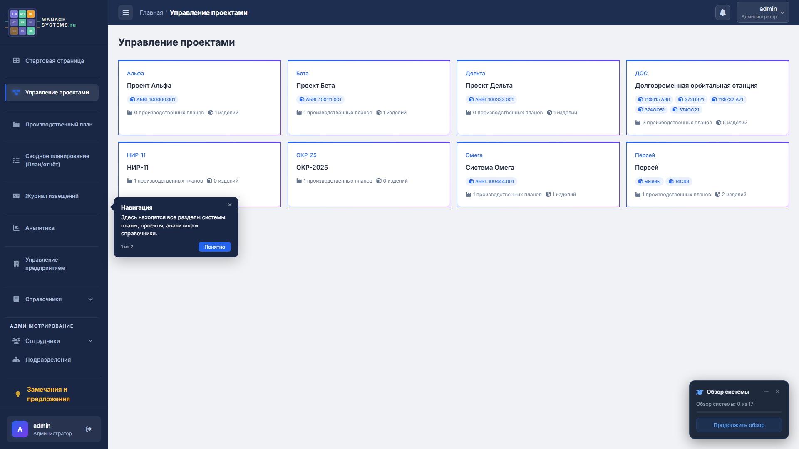
*Рис. 4.1. Страница управления проектами — карточная сетка*

### 4.2 Карточка проекта

Каждая карточка содержит:

```
┌─────────────────────────────────────┐
│  Полное наименование проекта        │
│                                     │
│  Краткое.имя  ·  Шифр               │  ← выделено акцентным цветом
│                                     │
│  3 ПП  ·  5 изделий                 │  ← метрики
│                                     │
│  [Изделие A] [Изделие B] [Изделие C]│  ← бейджи продуктов
│                                     │
│                        [✏] [🗑]     │  ← кнопки при наведении
└─────────────────────────────────────┘
```

При наведении карточка приподнимается (эффект hover) и появляются кнопки:
- **✏ Редактировать** — изменить данные проекта
- **🗑 Удалить** — удалить проект (с подтверждением)

### 4.3 Создание проекта

1. Нажмите кнопку **«Добавить проект»** (обычно вверху страницы).
2. В модальном окне заполните:

| Поле | Обязательное | Описание | Пример |
|------|-------------|----------|--------|
| **Полное наименование** | Да | Официальное название проекта | «Орбитальная станция нового поколения» |
| **Краткое наименование** | Нет | Используется в кодах строк ПП | «Орбита-НП» |
| **Шифр** | Нет | Код проекта | «ОРБ-2026» |

3. Нажмите **«Сохранить»**.

> **Важно.** Краткое наименование используется при автогенерации кодов строк ПП (формат: `Орбита-НП.1`, `Орбита-НП.2`, ...). Рекомендуется заполнять его при создании проекта.

### 4.4 Управление изделиями (продуктами)

Каждый проект может содержать список изделий (продуктов).

1. Нажмите на карточку проекта — откроется список его изделий.
2. Нажмите **«Добавить изделие»**.
3. Заполните:

| Поле | Описание | Пример |
|------|----------|--------|
| **Наименование** | Название изделия | «Модуль стыковочный» |
| **Краткое наименование** | Сокращение | «МС-1» |
| **Шифр** | Код изделия | «МС-2026-01» |

4. Нажмите **«Сохранить»**.

Изделия отображаются как цветные бейджи на карточке проекта. Для редактирования или удаления используйте кнопки на карточке изделия.

---

## 5. Производственный план (ПП)

### 5.1 Выбор проекта ПП

При переходе в раздел ПП открывается **список проектов ПП** — карточки с названиями планов.

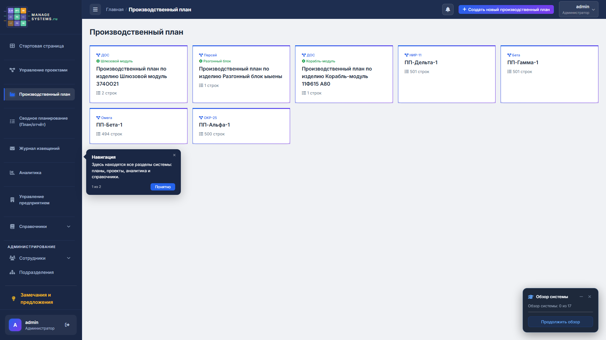
*Рис. 5.1. Список проектов производственного плана*

- Нажмите на карточку, чтобы открыть план проекта.
- Кнопка **«Создать проект ПП»** (только для администраторов) — создаёт новый план.

При создании проекта ПП:
1. Выберите **проект УП** (из справочника).
2. Система автоматически сгенерирует название плана в формате:
   ```
   Производственный план подразделения НТЦ по проекту/изделию "Орбита-НП"
   ```
3. Нажмите **«Сохранить»**.

### 5.2 Таблица производственного плана

После выбора проекта открывается основная таблица ПП.

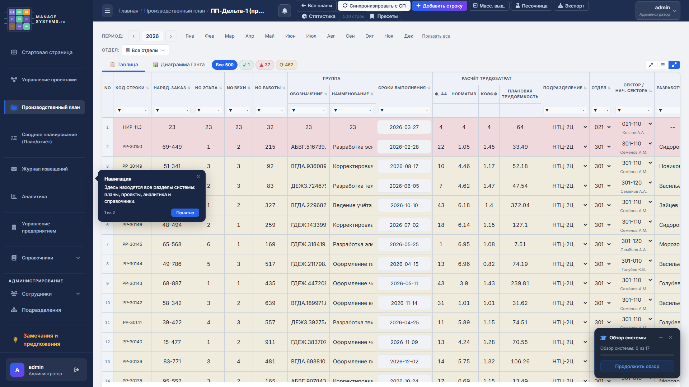
*Рис. 5.2. Таблица производственного плана с данными*

**Структура экрана ПП:**

```
┌─────────────────────────────────────────────────────────────────┐
│  ← Назад   Производственный план "Орбита-НП"                   │
├─────────────────────────────────────────────────────────────────┤
│  [Все: 150]  [Выполнено: 12]  [Просрочено: 23]  [В работе: 115]│  ← Статусная панель
├─────────────────────────────────────────────────────────────────┤
│  🔍 Поиск...          [+ Добавить строку]  [⇄ Синхр. с СП]     │  ← Панель инструментов
├─────────────────────────────────────────────────────────────────┤
│  Код▼│Заказ▼│Этап▼│Веха▼│№▼│Обозн.▼│Наимен.▼│Дата▼│...│Тип▼  │  ← Заголовки + фильтры
├──────┼──────┼─────┼─────┼──┼───────┼────────┼─────┼───┼──────┤
│ О.1  │ 42   │ 1   │ 1   │1 │ АБВ-1 │Расчёт..│03.26│...│ ПП   │  ← Строки данных
│ О.2  │ 42   │ 1   │ 1   │2 │ АБВ-2 │Чертёж..│04.26│...│ ПП   │
│ ...  │      │     │     │  │       │        │     │   │      │
└──────┴──────┴─────┴─────┴──┴───────┴────────┴─────┴───┴──────┘
```

### 5.3 Столбцы таблицы ПП

| Столбец | Описание | Редактирование |
|---------|----------|----------------|
| **Код строки** | Автоматический: `{Проект}.{N}` | Только чтение |
| **№ заказа** | Номер заказа / наряда | Двойной клик |
| **Этап** | Номер этапа | Двойной клик |
| **Веха** | Номер вехи | Двойной клик |
| **№ работы** | Порядковый номер работы | Двойной клик |
| **Обозначение** | Обозначение документа (шифр) | Двойной клик |
| **Наименование** | Название работы | Двойной клик |
| **Дата окончания** | Плановая дата завершения | Двойной клик (календарь) |
| **Листов А4** | Объём документации в листах | Двойной клик |
| **Норма** | Нормативная трудоёмкость (чел.-ч.) | Двойной клик |
| **Коэффициент** | Коэффициент сложности | Двойной клик |
| **Трудоёмкость** | Итого: норма × коэффициент | Авторасчёт |
| **Центр** | НТЦ-центр исполнителя | Двойной клик |
| **Отдел** | Отдел-исполнитель | Двойной клик |
| **Нач. сектора** | Ответственный начальник сектора | Двойной клик |
| **Исполнитель** | Назначенный исполнитель (ФИО) | Двойной клик |
| **Тип работы** | Категория работы (свободный текст) | Двойной клик |
| **Зав.** | Бейдж количества зависимостей | Клик для деталей |

### 5.4 Inline-редактирование ячеек

Таблица ПП поддерживает **редактирование на месте** — двойной клик по ячейке.

**Порядок действий:**

1. **Дважды кликните** по ячейке, которую хотите изменить.
2. Ячейка превращается в поле ввода (текстовое или выпадающий список).
3. Введите новое значение.
4. Нажмите **Enter** или кликните вне ячейки — данные сохранятся автоматически.
5. Нажмите **Esc** — отмена изменений.

> **Ограничение.** Вы можете редактировать только строки, относящиеся к вашему подразделению. Строки других отделов доступны только для просмотра.

**Особенности для разных типов полей:**
- **Текстовые** (наименование, обозначение) — обычное поле ввода
- **Числовые** (норма, коэффициент, листы А4) — поле с числовой клавиатурой
- **Даты** (дата окончания) — всплывающий календарь
- **Исполнитель, отдел** — выпадающий список сотрудников/подразделений

### 5.5 Добавление новой строки

1. Нажмите кнопку **«+ Добавить строку»** в панели инструментов.
2. Внизу таблицы появится новая пустая строка.
3. **Код строки** сгенерируется автоматически (формат: `Орбита-НП.15`).
4. Заполните ячейки двойным кликом.

> **Как работает код строки.** Система автоматически берёт краткое наименование проекта и добавляет порядковый номер через точку. Номер атомарный — при удалении строки он не переиспользуется (следующая строка получит новый номер).

### 5.6 Удаление строки

1. Нажмите кнопку **🗑** (корзина) в строке.
2. Подтвердите удаление в диалоговом окне.

> **Внимание.** Удаление необратимо. Если строка была синхронизирована с СП, связанная задача тоже будет затронута.

### 5.7 Статусная панель

Вверху таблицы расположена панель со счётчиками задач:

```
┌────────────┬───────────────┬──────────────┬──────────────┐
│ Все: 150   │ Выполнено: 12 │ Просрочено:23│ В работе: 115│
└────────────┴───────────────┴──────────────┴──────────────┘
```

Нажмите на любой счётчик, чтобы отфильтровать таблицу по этому статусу:

| Статус | Условие |
|--------|---------|
| **Все** | Все строки без фильтрации |
| **Выполнено** | Есть отчёт о выполнении |
| **Просрочено** | Дата окончания прошла, отчёта нет |
| **В работе** | Дата не прошла, отчёта нет |

Цвета: Выполнено — зелёный, Просрочено — красный, В работе — синий.

### 5.8 Мульти-фильтры столбцов

Каждый столбец имеет кнопку фильтра **▼** в заголовке.

**Как фильтровать:**

1. Нажмите кнопку **▼** в заголовке нужного столбца.
2. Откроется выпадающий список со всеми уникальными значениями.
3. Отметьте галочками нужные значения (можно выбрать несколько).
4. Таблица отфильтруется мгновенно.
5. На кнопке фильтра появится счётчик активных значений: **▼ (3)**.

**Сброс фильтра:** нажмите кнопку фильтра ещё раз и снимите все галочки, или нажмите «Сбросить».

> **Совет.** Фильтры можно комбинировать. Например: отдел = «021» И статус = «Просрочено» покажет только просроченные задачи 21-го отдела.

### 5.9 Сортировка

Нажмите на **текст заголовка** столбца (не на кнопку фильтра) для сортировки:

| Клик | Результат |
|------|-----------|
| 1-й | Сортировка по возрастанию ↑ |
| 2-й | Сортировка по убыванию ↓ |
| 3-й | Сброс сортировки |

Индикатор сортировки (▲/▼) отображается рядом с названием столбца.

### 5.10 Полнотекстовый поиск

Поле **🔍 Поиск...** в панели инструментов ищет по всем видимым столбцам одновременно.

Введите текст — таблица отфильтруется в реальном времени (с задержкой 300мс для комфорта ввода). Поиск ведётся по подстроке, регистр не учитывается.

Пример: ввод «чертёж» покажет все строки, где в любом столбце есть слово «чертёж».

### 5.11 Зависимости задач

Задачи ПП можно связывать логическими зависимостями для управления последовательностью выполнения.

**Типы зависимостей:**

| Тип | Полное название | Описание | Пример |
|-----|-----------------|----------|--------|
| **FS** | Finish-to-Start | B начинается после завершения A | Чертёж → Проверка |
| **SS** | Start-to-Start | B начинается вместе с A | Два параллельных расчёта |
| **FF** | Finish-to-Finish | B завершается вместе с A | Документ + его рецензия |
| **SF** | Start-to-Finish | B завершается после начала A | Редкий тип, для особых случаев |

**Лаг** — дополнительный сдвиг в рабочих днях. Пример: FS + лаг 3 дня = B начинается через 3 рабочих дня после завершения A.

**Создание зависимости:**

1. Откройте карточку задачи (нажмите на строку или кнопку ✏).
2. Перейдите в раздел **«Зависимости»**.
3. Нажмите **«Добавить зависимость»**.
4. Выберите:
   - **Предшественник** — задача, от которой зависит текущая
   - **Тип связи** — FS / SS / FF / SF
   - **Лаг** — сдвиг в рабочих днях (0 по умолчанию)
5. Нажмите **«Сохранить»**.

> **Защита от циклов.** Система автоматически проверяет, не создаёт ли новая зависимость цикл (A → B → C → A). Если цикл обнаружен — зависимость не сохраняется, и вы увидите сообщение об ошибке.

**Бейдж зависимостей:** В столбце «Зав.» отображается количество зависимостей задачи. Нажмите на бейдж для просмотра списка связей.

**Выравнивание дат:**

Кнопка **«Выровнять даты»** автоматически пересчитывает даты задач по цепочке зависимостей:
- **Обычное** — пересчитывает только прямых наследников
- **Каскадное** — пересчитывает всю цепочку до конца

> **Рабочие дни.** При выравнивании дат система учитывает производственный календарь: выходные и праздничные дни пропускаются.

### 5.12 Синхронизация ПП → СП

Кнопка **«⇄ Синхронизировать с СП»** переносит все строки текущего ПП в сводное планирование.

**Что происходит при синхронизации:**

| Ситуация | Действие |
|----------|----------|
| Строка ПП ещё не в СП | Создаётся новая задача в СП |
| Строка ПП уже есть в СП | Данные обновляются из ПП |
| Строка удалена из ПП | Задача в СП остаётся (но без привязки) |

**Заблокированные поля:** После синхронизации в задаче СП блокируются поля, унаследованные из ПП:
- Наименование
- Номер работы
- Обозначение
- Этап
- Обоснование

Эти поля можно изменить только в ПП, после чего повторить синхронизацию.

Обоснование синхронизированной задачи автоматически заполняется в формате:
```
ПП-план; Этап 1; Веха 2; Работа 3
```

### 5.13 Адаптивный вид

На мобильных устройствах и узких экранах таблица автоматически переключается в **карточный вид** — каждая строка отображается как отдельная карточка со всеми полями.

---

## 6. Сводное планирование (СП)

### 6.1 Обзор модуля

Сводное планирование — **единый план-отчёт** подразделения. Главное отличие от ПП:

| Признак | ПП | СП |
|---------|----|----|
| Фокус | Работы по проекту | Все задачи подразделения |
| Часы | Одна трудоёмкость | Помесячная разбивка |
| Редактирование | Inline (двойной клик) | Модальное окно |
| Отчётность | Нет | Есть (отчёты по задаче) |

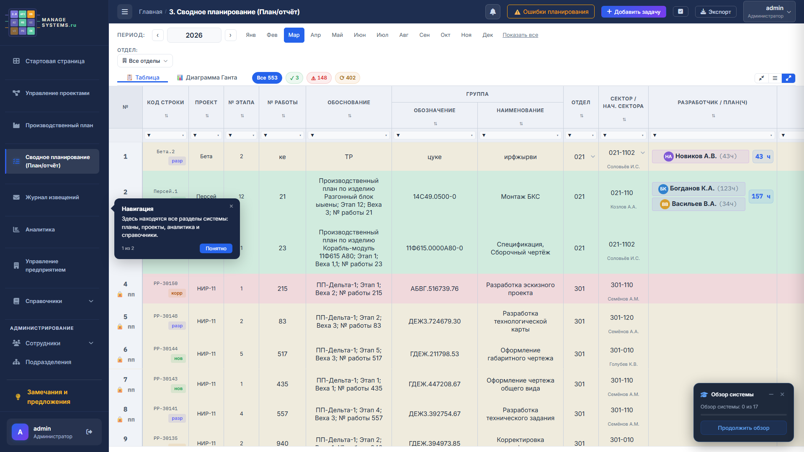
*Рис. 6.1. Таблица сводного планирования*

### 6.2 Структура экрана СП

```
┌────────────────────────────────────────────────────────────────────┐
│  3. Сводное планирование (План/отчёт)                              │
├────────────────────────────────────────────────────────────────────┤
│  [Все: 550] [Выполнено: 1] [Просрочено: 148] [В работе: 401]      │
├────────────────────────────────────────────────────────────────────┤
│  🔍 Поиск...  [+ Задача] [⚠ Ошибки] [Плотность ▤▥▦] [⚙ Столбцы]  │
├────────────────────────────────────────────────────────────────────┤
│  №▼ │Обозн▼│Наимен▼│Этап▼│Исп▼│Отдел▼│Янв▼│Фев▼│Мар▼│...│Дек▼│⚡│
├─────┼──────┼───────┼─────┼────┼──────┼────┼────┼────┼───┼────┼──┤
│  1  │АБВ-1 │Расчёт │ 1   │Иван│ 021  │ 40 │ 60 │ 80 │...│    │✏📊│
│  2  │АБВ-2 │Чертёж │ 1   │Пётр│ 022  │    │ 40 │ 40 │...│    │✏📊│
└─────┴──────┴───────┴─────┴────┴──────┴────┴────┴────┴───┴────┴──┘
```

### 6.3 Столбцы таблицы СП

**Основные столбцы:**

| Столбец | Описание |
|---------|----------|
| **№ работы** | Номер работы |
| **Обозначение** | Обозначение документа |
| **Наименование** | Название задачи |
| **Этап** | Номер этапа |
| **Веха** | Номер вехи |
| **Дата начала** | Плановая дата начала |
| **Дата окончания** | Плановая дата завершения |
| **Дедлайн** | Контрольный срок (отличается от даты окончания) |
| **Исполнитель** | Основной исполнитель |
| **Соисполнители** | Список дополнительных исполнителей |
| **Тип работы** | Категория работы |
| **Отдел** | Отдел-исполнитель |
| **Сектор** | Сектор-исполнитель |
| **Центр** | НТЦ-центр |
| **Зав.** | Количество зависимостей |

**Помесячные столбцы:**

| Столбец | Описание |
|---------|----------|
| **Янв, Фев, ... Дек** | Плановые часы на каждый месяц |

**Столбец действий:**

| Кнопка | Действие |
|--------|----------|
| **✏** | Открыть задачу на редактирование (модальное окно) |
| **📊** | Открыть отчёт по задаче |

### 6.4 Создание задачи

1. Нажмите **«+ Задача»** в панели инструментов (или **Ctrl+K** → «Новая задача»).
2. Откроется модальное окно с полями:

**Поля модального окна:**

| Поле | Обязательное | Описание |
|------|-------------|----------|
| **Наименование** | Да | Название задачи |
| **Тип работы** | Нет | Категория (свободный текст) |
| **Проект** | Нет | Привязка к проекту УП |
| **Этап** | Нет | Номер этапа |
| **Веха** | Нет | Номер вехи |
| **Обозначение** | Нет | Шифр документа |
| **Дата начала** | Нет | Плановое начало |
| **Дата окончания** | Нет | Плановое завершение |
| **Дедлайн** | Нет | Контрольный срок |
| **Исполнитель** | Нет | Основной исполнитель (выбор из справочника) |
| **Соисполнители** | Нет | Список дополнительных исполнителей |
| **Обоснование** | Нет | Основание для работы |
| **Помесячные часы** | Нет | Распределение трудозатрат по месяцам |

3. Заполните нужные поля.
4. Нажмите **«Сохранить»**.

### 6.5 Редактирование задачи

1. Нажмите кнопку **✏** (карандаш) в строке задачи.
2. Откроется то же модальное окно с заполненными данными.
3. Внесите изменения.
4. Нажмите **«Сохранить»**.

> **Заблокированные поля.** Если задача перенесена из ПП (отмечена флагом `from_pp`), часть полей заблокирована для редактирования: наименование, номер, обозначение, этап, обоснование. Рядом с такими полями отображается иконка замка 🔒. Чтобы изменить эти поля — отредактируйте строку в ПП и повторите синхронизацию.

### 6.6 Отчёт по задаче

1. Нажмите кнопку **📊** (график) в строке задачи.
2. Откроется модальное окно отчёта.
3. Заполните данные о выполнении.
4. Нажмите **«Сохранить»**.

> **Автоматическое создание извещения.** Если в отчёте указан тип работы **«Корректировка документа»**, система автоматически создаст запись в Журнале извещений (ЖИ) с данными из задачи.

### 6.7 Помесячные часы

Столбцы **Янв–Дек** отображают плановые трудозатраты в часах за каждый месяц.

**Как заполнять:**
1. Откройте задачу на редактирование (✏).
2. В модальном окне — блок «Помесячные часы».
3. Введите количество часов для каждого месяца.
4. Сохраните.

Итого часов по задаче отображается в столбце **«Всего часов»**.

### 6.8 Ошибки планирования

Кнопка **«⚠ Ошибки»** в панели инструментов запускает проверку качества планирования.

**Проверяемые ошибки:**

| Ошибка | Описание |
|--------|----------|
| Нет исполнителя | Задача без назначенного исполнителя |
| Нет часов | Задача без распределения плановых часов |
| Пересечение с отпуском | Плановые часы приходятся на период отпуска исполнителя |
| Нет дат | Задача без дат начала/окончания |

Результаты отображаются в виде списка — нажмите на ошибку для перехода к соответствующей задаче.

### 6.9 Плотность строк

Три режима отображения (переключатель в панели инструментов):

| Режим | Высота строки | Когда использовать |
|-------|---------------|-------------------|
| **▤ Компактный** | Минимальная | Обзор большого количества задач |
| **▥ Средний** | Стандартная | Ежедневная работа (по умолчанию) |
| **▦ Просторный** | Увеличенная | Работа с длинными названиями |

Настройка сохраняется в браузере и действует до изменения.

### 6.10 Управление столбцами

Кнопка **«⚙ Столбцы»** в панели инструментов позволяет:

- **Показать/скрыть** столбцы — снимите галочку для скрытия
- **Изменить порядок** — перетащите столбец в нужную позицию
- **Изменить ширину** — перетащите правую границу заголовка столбца

Ширины столбцов **автоматически сохраняются на сервере** и восстанавливаются при следующем входе.

**Сброс ширин:** Профиль → «Моё меню» → кнопка **«Сбросить ширины столбцов»**.

### 6.11 Фильтрация и поиск

Работает аналогично ПП (см. раздел 5.8–5.10):
- Статусная панель (Все / Выполнено / Просрочено / В работе)
- Мульти-фильтры по столбцам (▼)
- Полнотекстовый поиск (🔍)
- Сортировка по заголовкам

### 6.12 Бесконечная прокрутка

Таблица загружает данные порциями по мере прокрутки (бесконечная прокрутка). Вам не нужно переходить по страницам — просто прокручивайте вниз, и новые строки подгрузятся автоматически.

Внизу таблицы отображается счётчик: **«Записей: 150 (из 550)»**.

---

## 7. Журнал извещений (ЖИ)

### 7.1 Назначение

Журнал извещений — модуль учёта извещений об изменениях (**ИИ**) и предварительных извещений (**ПИ**) с контролем сроков погашения.

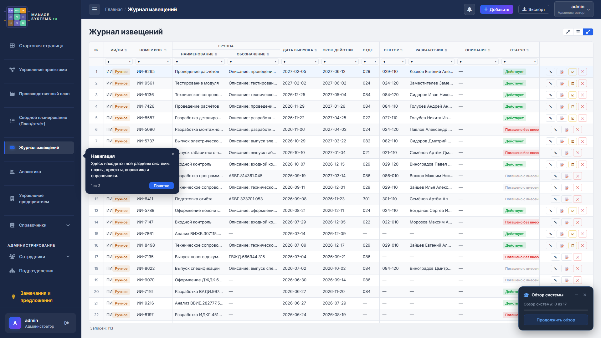
*Рис. 7.1. Журнал извещений*

### 7.2 Типы записей и статусы

**Типы:**

| Тип | Описание |
|-----|----------|
| **ИИ** | Извещение об изменении — постоянное изменение документации |
| **ПИ** | Предварительное извещение — временное, с датой действия |

**Статусы:**

| Статус | Цвет | Описание |
|--------|------|----------|
| **Активное** | 🟢 Зелёный | ИИ выпущено, ожидает погашения |
| **Истекшее** | 🟡 Жёлтый | ПИ, у которого прошла дата действия |
| **Погашено (да)** | 🔵 Синий | Выпущено погашающее извещение |
| **Погашено (нет)** | ⚪ Серый | Закрыто без погашающего извещения |

### 7.3 Столбцы журнала

| Столбец | Описание |
|---------|----------|
| **ИИ/ПИ** | Тип извещения |
| **Номер** | Номер извещения |
| **Тема** | Краткое описание изменения |
| **Обозначение** | Обозначение изменяемого документа |
| **Дата выпуска** | Дата выпуска извещения |
| **Дата истечения** | Срок действия (для ПИ) |
| **Отдел** | Отдел-исполнитель |
| **Сектор** | Сектор-исполнитель |
| **Исполнитель** | Ответственный исполнитель |
| **Описание** | Подробное описание изменения |
| **Статус** | Текущий статус извещения |

### 7.4 Создание записи

**Автоматический режим:**
При создании отчёта по задаче с типом **«Корректировка документа»** запись в ЖИ создаётся автоматически. Данные подтягиваются из задачи: обозначение, исполнитель, подразделение.

**Ручной режим:**
1. Нажмите **«Добавить»**.
2. Заполните модальное окно:
   - Тип (ИИ/ПИ)
   - Номер извещения
   - Тема изменения
   - Обозначение документа
   - Даты: выпуска, истечения
   - Отдел, сектор, исполнитель
   - Описание
3. Нажмите **«Сохранить»**.

> **Проверка дубликатов.** Система проверяет уникальность номера извещения и предупреждает, если такой номер уже существует.

### 7.5 Погашение извещения

1. Откройте запись на редактирование (кнопка ✏).
2. Заполните блок **«Погашение»**:
   - **Номер погашающего извещения** — номер нового ИИ/ПИ, которое погашает текущее
   - **Дата погашения** — дата выпуска погашающего извещения
   - **Исполнитель погашения** — кто выпустил погашающее извещение
3. Нажмите **«Сохранить»**.

Статус автоматически изменится на **«Погашено (да)»** или **«Погашено (нет)»**.

### 7.6 Фильтрация и сортировка

Аналогично ПП и СП:
- Мульти-фильтры по каждому столбцу (▼)
- Сортировка по заголовкам (▲/▼)
- Бесконечная прокрутка

---

## 8. Аналитика

### 8.1 Три аналитических доски

Модуль аналитики содержит три специализированных доски для разных ролей.

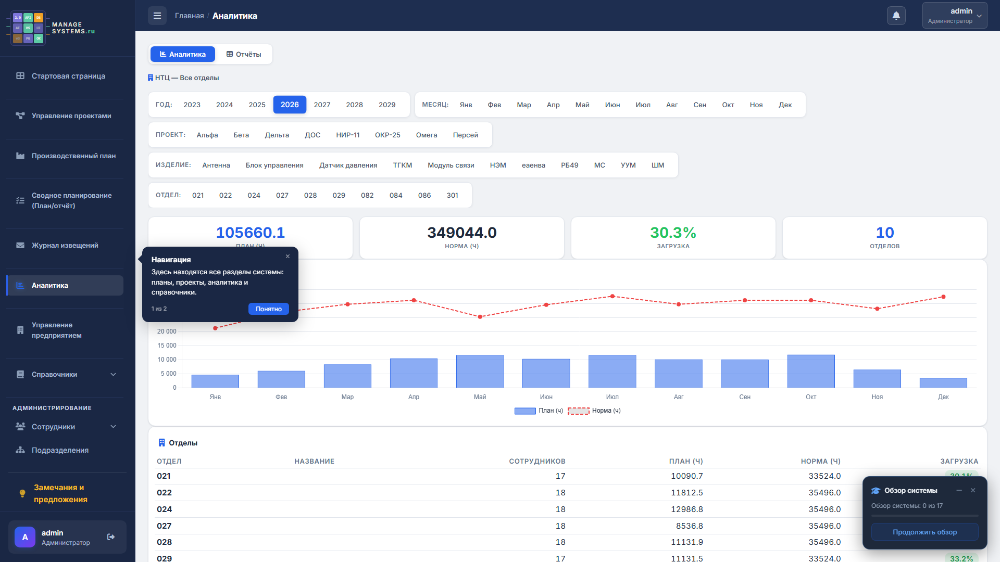
*Рис. 8.1. Модуль аналитики — доска руководителя*

### 8.2 Доска руководителя (загрузка по НТЦ и отделам)

**Целевая аудитория:** начальники отделов, руководители НТЦ, зам. руководителей.

**Виджеты:**

| Виджет | Описание | Тип |
|--------|----------|-----|
| **Загрузка по отделам** | Столбчатая диаграмма загрузки каждого отдела по месяцам | График |
| **Дедлайны** | Список просроченных и горящих задач с датами и исполнителями | Таблица |
| **Статусы задач** | Распределение по статусам (в работе / выполнено / просрочено) | Круговая диаграмма |
| **Загрузка сотрудников** | Drilldown — детальная загрузка по сотрудникам внутри отдела | Таблица |

**Фильтры:**
- **Год** — выбор года для отображения
- **Отдел** — фильтр по конкретному отделу (или все)

### 8.3 Доска сотрудника

**Целевая аудитория:** исполнители, любые сотрудники.

**Виджеты:**

| Виджет | Описание |
|--------|----------|
| **Карточки-итоги** | Всего часов, В работе, Выполнено, Просрочено |
| **Загрузка по месяцам** | Персональный график распределения часов |
| **Список задач** | Таблица задач с фильтрацией по статусу |

**Фильтры:**
- **Год** — выбор года
- **Сотрудник** — для руководителей (выбор подчинённого)

### 8.4 Доска ПП

**Целевая аудитория:** руководители проектов, начальники отделов.

**Виджеты:**

| Виджет | Описание |
|--------|----------|
| **% выполнения** | Общий процент завершения производственного плана |
| **Распределение статусов** | Диаграмма по статусам задач |
| **Нагрузка по отделам** | Распределение трудоёмкости по подразделениям |
| **Трудоёмкость по этапам** | Разбивка по этапам проекта |

---

## 9. Производственный календарь

### 9.1 Общий вид

Страница производственного календаря разделена на две части.

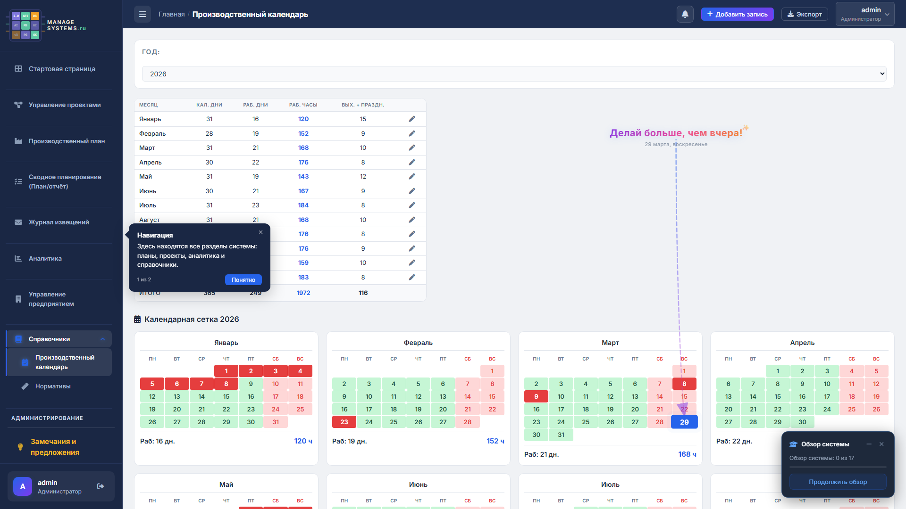
*Рис. 9.1. Производственный календарь*

### 9.2 Сводная таблица

Таблица с нормативными рабочими часами по месяцам:

```
┌──────────┬──────────────┬──────────────┐
│ Месяц    │ Рабочих часов│ Рабочих дней │
├──────────┼──────────────┼──────────────┤
│ Январь   │     136      │      17      │
│ Февраль  │     152      │      19      │
│ Март     │     168      │      21      │
│ ...      │     ...      │      ...     │
│ Декабрь  │     176      │      22      │
├──────────┼──────────────┼──────────────┤
│ ИТОГО    │    1 973     │     247      │
└──────────┴──────────────┴──────────────┘
```

Для администраторов — кнопка ✏ в каждой строке для редактирования.

### 9.3 Мини-календари

12 визуальных месячных календарей (4 в ряд на широком экране):

- Выходные дни (суббота, воскресенье) — выделены **красным**
- Праздничные дни — дополнительная пометка
- Обычные рабочие дни — стандартный цвет

### 9.4 Управление праздничными днями (только админ)

1. Нажмите **«Добавить праздничный день»**.
2. Укажите:
   - **Дата** — дата нерабочего дня
   - **Название** — описание (например, «День России»)
3. Нажмите **«Сохранить»**.

Для удаления — кнопка 🗑 рядом с праздником.

> **Важно.** Праздничные дни автоматически учитываются при расчёте рабочих дней в зависимостях задач (выравнивание дат). При добавлении/удалении праздника кеш пересчитывается автоматически.

---

## 10. Сотрудники

### 10.1 Список сотрудников

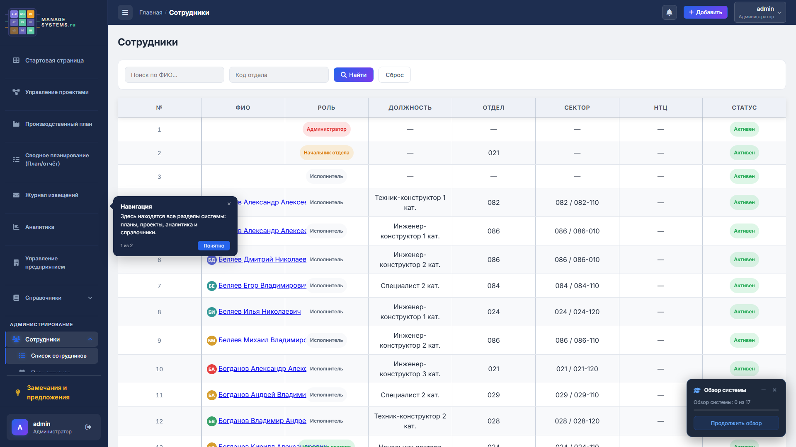
*Рис. 10.1. Список сотрудников с поиском и фильтрацией*

**Поиск и фильтрация:**
- Поле **«ФИО»** — поиск по полному имени
- Выпадающий список **«Отдел»** — фильтр по подразделению
- Кнопка **«Найти»** — применить фильтры
- Кнопка **«Сброс»** — сбросить фильтры

**Столбцы таблицы:**

| Столбец | Описание |
|---------|----------|
| **№** | Порядковый номер |
| **ФИО** | Полное имя (ссылка на карточку сотрудника) |
| **Роль** | Цветной бейдж с названием роли |
| **Должность** | Должность сотрудника |
| **Отдел** | Код отдела |
| **Сектор** | Код сектора |
| **НТЦ** | Код НТЦ-центра |
| **Статус** | «Активен» (зелёный) / «Уволен» (серый) |

**Цветовое кодирование ролей:**

| Цвет | Роль |
|------|------|
| 🔴 Красный | Администратор |
| 🔵 Синий | Руководитель НТЦ / Зам. руководителя НТЦ |
| 🟡 Жёлтый | Начальник отдела / Зам. начальника отдела |
| 🟢 Зелёный | Начальник сектора |
| ⚪ Серый | Исполнитель |

**Постраничная навигация:**
Внизу таблицы — номера страниц с кнопками «Предыдущая» / «Следующая».

### 10.2 Карточка сотрудника

Нажмите на ФИО в списке — откроется детальная карточка:
- Полное имя, аватар
- Роль, должность
- НТЦ, отдел, сектор
- Контакты: телефон, email
- Статус (активен/уволен)

---

## 11. План отпусков и командировок

### 11.1 План отпусков

**Просмотр:**
Таблица отпусков с фильтрацией по подразделению (видимость зависит от роли).

**Создание записи:**
1. Нажмите **«Добавить»**.
2. Укажите: сотрудника, дату начала, дату окончания, тип отпуска.
3. Нажмите **«Сохранить»**.

**Проверка пересечений:**
Система автоматически проверяет:
- Пересечение отпусков сотрудников одного подразделения
- Наложение отпусков и командировок

> **Учёт в СП.** Отпуска учитываются при проверке ошибок планирования (кнопка «⚠ Ошибки» в СП). Если плановые часы назначены на период отпуска — это будет отмечено как ошибка.

### 11.2 План командировок

Аналогичная таблица для учёта командировок: сотрудник, даты, место назначения.

---

## 12. Профиль и настройки

### 12.1 Страница профиля

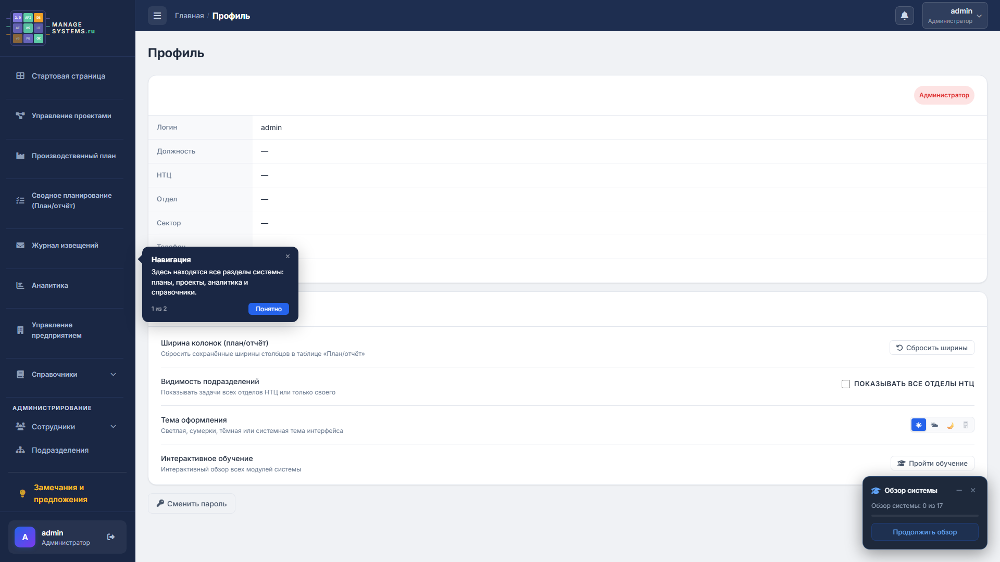
*Рис. 12.1. Страница профиля с настройками*

**Информация о пользователе:**

```
┌──────────────────────────────────────────┐
│  [Аватар]  admin                         │
│            Администратор   ← бейдж роли  │
│                                          │
│  Логин:       admin                      │
│  Должность:   Системный администратор    │
│  НТЦ:         НТЦ                        │
│  Отдел:       —                          │
│  Сектор:      —                          │
│  Телефон:     +7 (495) ...               │
│  Email:       admin@ntc.local            │
└──────────────────────────────────────────┘
```

### 12.2 Моё меню — настройки

Блок **«Моё меню»** содержит персональные настройки:

#### Сброс ширин столбцов
Кнопка **«Сбросить ширины»** возвращает все таблицы (ПП и СП) к ширинам столбцов по умолчанию. Полезно, если вы случайно сделали столбец слишком узким или широким.

#### Показывать все отделы НТЦ
Переключатель (checkbox) — доступен только для ролей **Руководитель НТЦ** и **Зам. руководителя НТЦ**.
- **Включён** — видны данные всех отделов НТЦ
- **Выключен** — видны данные только своего отдела

#### Тема оформления
Четыре кнопки выбора темы:

| Кнопка | Тема | Описание |
|--------|------|----------|
| ☀ | **Светлая** | Белый фон, тёмный текст — для светлых помещений |
| 🌤 | **Сумеречная** | Приглушённые тона — компромисс |
| 🌙 | **Тёмная** | Тёмный фон, светлый текст — снижает нагрузку на глаза |
| 🖥 | **Системная** | Автоматически следует настройке ОС (тёмная/светлая) |

Тема применяется мгновенно и сохраняется в браузере.

#### Интерактивное обучение
Кнопка **«Пройти обучение»** — перезапускает обучающий тур с первого шага. Полезно для знакомства с новыми функциями после обновления.

Описание: *«Интерактивный обзор всех модулей системы»*

#### Смена пароля
Ссылка на форму смены пароля. Введите текущий пароль, затем новый дважды.

---

## 13. Горячие клавиши и быстрые действия

### 13.1 Глобальные горячие клавиши

| Клавиша | Действие | Где работает |
|---------|----------|-------------|
| **Ctrl+K** / **Cmd+K** | Командная палитра | Везде |
| **Esc** | Закрыть модальное окно | Везде |
| **Esc** | Пропустить шаг обучения | Во время тура |
| **Enter** | Следующий шаг обучения | Во время тура |

### 13.2 В таблицах

| Действие | Результат | Где |
|----------|-----------|-----|
| **Двойной клик** по ячейке | Inline-редактирование | ПП |
| **Enter** в ячейке | Сохранить изменения | ПП |
| **Esc** в ячейке | Отменить изменения | ПП |
| **Клик** на заголовок столбца | Сортировка | ПП, СП, ЖИ |
| **Клик** на ▼ в заголовке | Открыть мульти-фильтр | ПП, СП, ЖИ |
| **Клик** на статус-бейдж | Фильтрация по статусу | ПП, СП |

### 13.3 Быстрые действия

| Действие | Как |
|----------|-----|
| Перейти на любую страницу | Ctrl+K → начать набирать |
| Создать задачу в СП | Ctrl+K → «Новая задача» |
| Сменить тему | Ctrl+K → «Сменить тему» |
| Экспорт таблицы | Ctrl+K → «Экспорт» |
| Свернуть сайдбар | Кнопка ☰ в шапке |

---

## 14. Роли и права доступа

### 14.1 Таблица ролей

Система поддерживает 7 ролей с иерархической моделью доступа:

| Роль | Бейдж | Создание | Редактирование | Удаление | Администрирование |
|------|-------|----------|----------------|----------|-------------------|
| **Администратор** | 🔴 | Все данные | Все данные | Все данные | Полный доступ |
| **Руководитель НТЦ** | 🔵 | Свой НТЦ | Свой НТЦ | Свой НТЦ | — |
| **Зам. рук. НТЦ** | 🔵 | Свой НТЦ | Свой НТЦ | Свой НТЦ | — |
| **Начальник отдела** | 🟡 | Свой отдел | Свой отдел | Свой отдел | — |
| **Зам. нач. отдела** | 🟡 | Свой отдел | Свой отдел | Свой отдел | — |
| **Начальник сектора** | 🟢 | Свой сектор | Свой сектор | Свой сектор | — |
| **Исполнитель** | ⚪ | — | — | — | — |

### 14.2 Область видимости данных

```
                 ┌──────────────────┐
                 │  Администратор   │  ← Видит ВСЁ
                 └────────┬─────────┘
                          │
              ┌───────────┴───────────┐
              │   Руководитель НТЦ    │  ← Видит весь НТЦ
              │   Зам. рук. НТЦ      │
              └───────────┬───────────┘
                          │
         ┌────────────────┼────────────────┐
         │                │                │
    ┌────┴─────┐    ┌─────┴────┐    ┌──────┴────┐
    │ Нач. 021 │    │ Нач. 022 │    │ Нач. 029  │  ← Видит свой отдел
    │ Зам. 021 │    │ Зам. 022 │    │ Зам. 029  │
    └────┬─────┘    └──────────┘    └───────────┘
         │
    ┌────┴─────┐
    │ Нач.секто│  ← Видит свой сектор
    │ ра 021-1 │
    └────┬─────┘
         │
    ┌────┴─────┐
    │Исполнит. │  ← Видит только свои задачи
    └──────────┘
```

**Особенности:**
- **Производственный план** — общий документ, видимый всем (нет фильтрации по ролям)
- **Руководители НТЦ** с включённой настройкой «Показывать все отделы» — видят данные всех отделов
- **Исполнитель** — видит только задачи, где он назначен исполнителем

### 14.3 Делегирование полномочий

Механизм временной передачи прав на период отсутствия (отпуск, командировка):

1. Администратор создаёт запись делегирования.
2. Указывает:
   - **Кто делегирует** — отсутствующий сотрудник
   - **Кому** — замещающий сотрудник
   - **До какой даты** — срок действия
   - **С правом записи** — да/нет
3. Замещающий сотрудник получает доступ к данным делегирующего.

> **Автоматическое истечение.** По достижении даты окончания делегирование прекращается автоматически.

---

## 15. Типовые сценарии работы

### 15.1 Сценарий: Начальник отдела формирует план

```
1. Войти в систему
2. Перейти в «Производственный план»
3. Выбрать проект ПП (или создать новый)
4. Добавить строки работ (кнопка «+»)
5. Заполнить: наименование, исполнитель, дата, норма, коэффициент
6. Создать зависимости между задачами (если нужно)
7. Выровнять даты (кнопка «Выровнять»)
8. Синхронизировать с СП (кнопка «⇄ Синхр. с СП»)
9. Перейти в «Сводное планирование»
10. Распределить часы по месяцам в каждой задаче
11. Проверить ошибки (кнопка «⚠ Ошибки»)
12. Посмотреть аналитику загрузки (раздел «Аналитика»)
```

### 15.2 Сценарий: Исполнитель просматривает задачи

```
1. Войти в систему → открывается Дашборд
2. На дашборде видны: текущие задачи, просроченные, уведомления
3. Перейти в «Сводное планирование»
4. В таблице видны только задачи, назначенные вам
5. Открыть задачу (кнопка ✏) для просмотра деталей
6. Создать отчёт (кнопка 📊) после выполнения работы
```

### 15.3 Сценарий: Руководитель НТЦ контролирует загрузку

```
1. Войти в систему → Дашборд с общими метриками
2. Обратить внимание на отделы с загрузкой > 100% (красный)
3. Перейти в «Аналитика» → «Доска руководителя»
4. Выбрать перегруженный отдел — увидеть детализацию
5. Перейти в «Сводное планирование»
6. Отфильтровать по отделу и статусу «Просрочено»
7. Принять меры: перераспределить задачи, скорректировать сроки
```

### 15.4 Сценарий: Администратор добавляет нового сотрудника

```
1. Перейти в «Список сотрудников» → кнопка «Добавить»
2. Заполнить: ФИО, логин, пароль, роль, подразделение, должность
3. Сохранить
4. Сообщить сотруднику логин и пароль
5. При первом входе сотрудник увидит обучающий тур
```

### 15.5 Сценарий: Работа с зависимостями и Ганттом

```
1. Открыть проект ПП
2. Создать задачи A, B, C
3. Открыть задачу B → «Зависимости» → добавить: A → B (FS, лаг 0)
4. Открыть задачу C → «Зависимости» → добавить: B → C (FS, лаг 2 дня)
5. Выровнять даты → система пересчитает:
   - B начнётся на след. рабочий день после окончания A
   - C начнётся через 2 рабочих дня после окончания B
6. Посмотреть диаграмму Ганта для визуализации цепочки
```

---

## 16. Устранение неполадок и FAQ

### Общие вопросы

**В: Как быстро перейти на нужную страницу?**
О: Нажмите **Ctrl+K** и начните вводить название раздела. Система покажет подходящие результаты.

**В: Как сменить тему оформления?**
О: Профиль → «Моё меню» → выберите тему. Или быстро: Ctrl+K → «Сменить тему».

**В: Как пройти обучение заново?**
О: Профиль → «Моё меню» → кнопка **«Пройти обучение»**.

**В: Данные таблицы не загружаются / страница пустая.**
О: Проверьте интернет-соединение. Обновите страницу (F5). Если проблема сохраняется — обратитесь к администратору.

**В: Интерфейс выглядит «сломанным» (элементы наезжают друг на друга).**
О: Попробуйте: 1) Обновить страницу (Ctrl+F5); 2) Сбросить ширины столбцов (Профиль → «Сбросить ширины»); 3) Попробовать другой браузер.

### Производственный план

**В: Почему я не могу редактировать строку?**
О: Возможные причины:
1. Строка относится к другому подразделению
2. Ваша роль — «Исполнитель» (нет права записи)
3. Действие делегирования истекло

**В: Как перенести данные из ПП в СП?**
О: Кнопка **«⇄ Синхронизировать с СП»** на странице ПП. Все строки текущего ПП будут перенесены/обновлены в СП.

**В: Код строки не генерируется.**
О: Проверьте, что у проекта заполнено **«Краткое наименование»** — оно используется как префикс кода.

**В: Система не даёт создать зависимость.**
О: Проверьте, не создаёт ли зависимость цикл. Например: A → B → C → A — цикл запрещён. Также нельзя создать зависимость задачи на саму себя.

### Сводное планирование

**В: Почему некоторые поля задачи заблокированы (🔒)?**
О: Задача перенесена из ПП. Заблокированные поля (наименование, номер, обозначение, этап, обоснование) редактируются только в ПП. Отредактируйте строку в ПП и повторите синхронизацию.

**В: Что означают ошибки планирования?**
О: Кнопка **«⚠ Ошибки»** проверяет: задачи без исполнителя, без часов, пересечения с отпусками, без дат. Нажмите на ошибку — система подсветит соответствующую задачу.

**В: Как восстановить ширины столбцов по умолчанию?**
О: Профиль → «Моё меню» → кнопка **«Сбросить ширины столбцов»**.

**В: Таблица загружается слишком долго.**
О: Данные загружаются порциями (бесконечная прокрутка). При большом количестве задач первая загрузка может занять несколько секунд. Используйте фильтры для сужения выборки.

### Журнал извещений

**В: Как создаётся запись автоматически?**
О: При создании отчёта по задаче с типом **«Корректировка документа»** запись в журнале создаётся автоматически.

**В: Как погасить извещение?**
О: Откройте запись (✏) → заполните блок «Погашение» (номер, дата, исполнитель) → сохраните.

**В: Номер извещения уже существует.**
О: Система проверяет уникальность номера. Используйте другой номер или проверьте, нет ли дубликата в журнале.

### Аналитика

**В: Почему я вижу не все данные?**
О: Аналитика показывает данные в рамках вашей области видимости (роли). Руководители НТЦ могут включить «Показывать все отделы» в профиле.

### Безопасность

**В: Как сменить пароль?**
О: Профиль → ссылка **«Смена пароля»** → введите текущий пароль и новый дважды.

**В: Что делать, если забыл пароль?**
О: На странице входа нажмите **«Забыли пароль?»** → введите email → на почту придёт ссылка для сброса.

**В: Сессия истекла, система просит войти заново.**
О: Это нормальное поведение. Сессия действует ограниченное время для безопасности. Войдите снова.

---

## Приложение А. Глоссарий

| Термин | Описание |
|--------|----------|
| **ПП** | Производственный план — план работ по конкретному проекту/изделию |
| **СП** | Сводное планирование — единый план-отчёт подразделения |
| **ЖИ** | Журнал извещений — учёт ИИ и ПИ |
| **ИИ** | Извещение об изменении — документ об изменении в КД/ТД |
| **ПИ** | Предварительное извещение — временное извещение с ограниченным сроком |
| **УП** | Управление проектами — реестр проектов и изделий |
| **НТЦ** | Научно-технический центр |
| **FS** | Finish-to-Start — тип зависимости задач |
| **Inline-редактирование** | Редактирование ячейки «на месте» двойным кликом |
| **Мульти-фильтр** | Фильтр с выбором нескольких значений одновременно |
| **Бейдж** | Цветная метка (роль, статус, количество) |
| **Дашборд** | Стартовая страница с персональной сводкой |
| **Делегирование** | Временная передача полномочий другому сотруднику |

---

## Приложение Б. Скриншоты

Все скриншоты сохранены в папке `docs/screenshots/` (разрешение 1920×1080, тёмная тема):

| Файл | Содержимое |
|------|------------|
| `login.png` | Экран авторизации |
| `tour_step.png` | Шаг обучающего тура (приветственное окно) |
| `sidebar.png` | Боковая панель навигации |
| `command_palette.png` | Командная палитра (Ctrl+K) |
| `dashboard.png` | Стартовая страница (дашборд руководителя) |
| `projects.png` | Управление проектами (карточки) |
| `pp_projects.png` | Список проектов ПП |
| `pp_table.png` | Таблица производственного плана |
| `plan_table.png` | Таблица сводного планирования |
| `notices.png` | Журнал извещений |
| `analytics.png` | Доска аналитики |
| `work_calendar.png` | Производственный календарь |
| `employees.png` | Список сотрудников |
| `profile.png` | Страница профиля |
